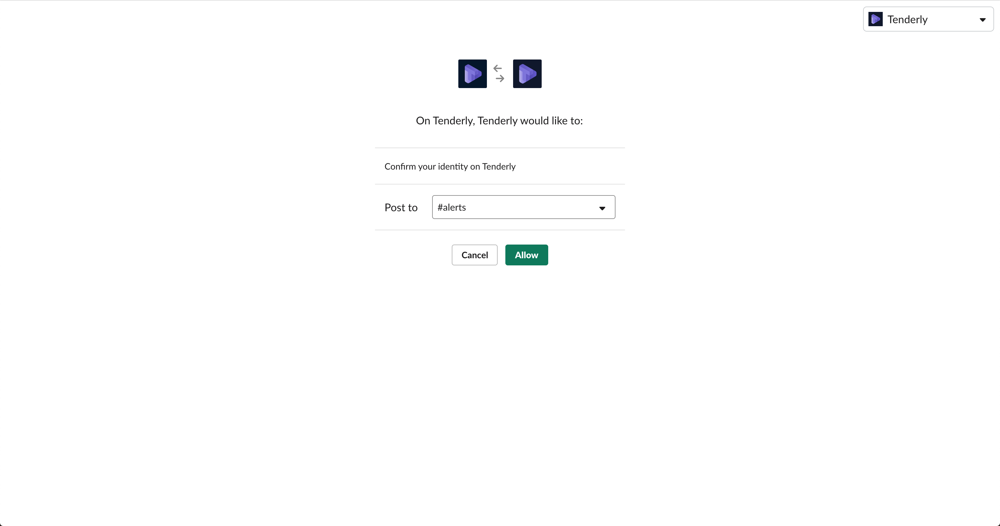

# Configuring Alert Destinations

Alert destinations need to be set up only once per organization and will be available for all projects.


#### All destinations are shared account-wide on all projects. If you edit or delete a destination, it will be applied to all projects and active rules.


Open Destinations tab:


## Email

Go to **Alerting** -> **Destinations** and click **Email** to add a new email for alert delivery:


You'll get a verification request to your email. Copy or click the link to confim the verification and you'll receive alerting notifications via email as well.

## Slack

You can connect Tenderly to your Slack workspace and get real-time notifications when an alert rule matches a transaction. Connecting multiple channels is also supported, so you can route certain rules to specific channels.

Navigate to a project and go to the **Alerts** tab. Next, click **Destinations**.

.png>)

Finally, click **Slack** and then **Connect Slack**.


This will take you to the Slack permissions screen where you need to pick to which channel you want to receive your notifications.



And that's it! When a transaction matches a configured alert rule, you'll get a notification instantly delivered to your Slack channel.



Check out how to [create an Alert here.](../../creating-an-alert/)


## Telegram

Go to **Alerting** -> **Destinations** and click **Telegram** to add a new Telegram channel for alert delivery:


Next, follow the onscreen instructions:


## Discord

Go to **Alerting** -> **Destinations** and click on **Discord** to connect a Discord channel for alert delivery.&#x20;

Firstly you will need to open your Discord, go to **Settings** -> **Integrations** -> **New Webhook**, name it and choose a Discord delivery channel, and copy the Webhook URL back into Tenderly:


## Sentry

Adding Sentry as a new alert destination is also pretty straightforward. In your Tenderly Dashboard, go to **Alerting** in the **Monitoring** section and choose the **Destinations** tab:

.png>)

Pick **Sentry** from the list of available Destinations. Next, a window will pop up asking you to fill in your DSN Address and a Label for you to choose. You can find your project DSN in the “**Client Keys**” section of your “**Project Settings**” in Sentry.


And voilà! Your Sentry project is now connected to Tenderly:

.png>)

## PagerDuty

Go to the **Destinations** tab, pick PagerDuty, and click **Connect PagerDuty**:


You'll get redirected to a PagerDuty page, where you can approve Tenderly as a source.

.png>)

If done correctly, PagerDuty should be under your **Active Destinations.**

## **Web3 Actions**

This type of alert trigger means your action will be used as a [**destination for the alert**](../../creating-an-alert/).

```yaml
trigger:
  type: alert
  alert: {}
```

A single action can be used as a destination for multiple alerts.

For more information, [read more about this and Web3 Actions in general](../../../web3-actions/intro-to-web3-actions/triggers.md).
