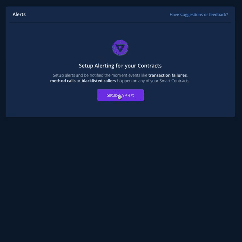

# Creating an Alert




First of all, before creating an alert we need to configure Alert destination. If you haven't done that yet [check out how to configure Alert destinations.](../alerting/alert-targets/configuring-alert-destinations/)


### Get an alert when a transaction fails

Let’s say I want to get alerted whenever any of my Smart Contracts fail. What I would do is the following:

Now if a transaction ever fails, I get notified instantly. This means that I can act immediately instead of waiting for my Dapp users to contact me that something isn’t working, like in the following Alert example:

You can read more broadly about this on [https://blog.tenderly.co/how-to-set-up-real-time-alerting-for-smart-contracts-with-tenderly/](https://blog.tenderly.co/how-to-set-up-real-time-alerting-for-smart-contracts-with-tenderly/).

