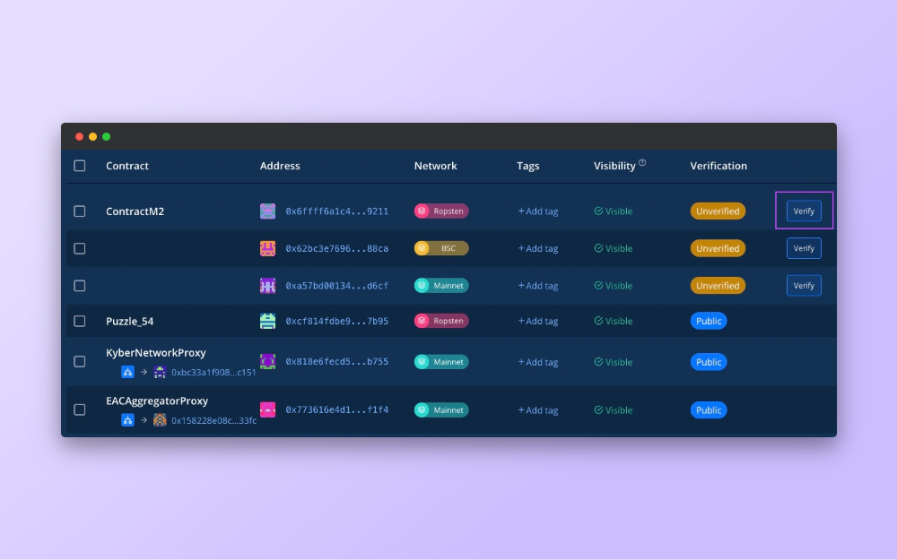
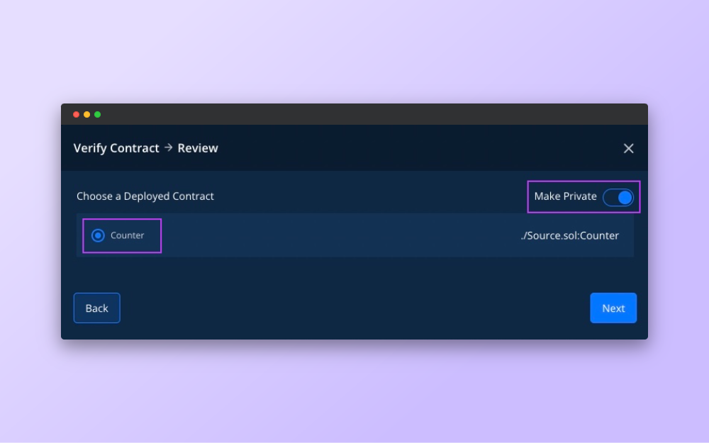
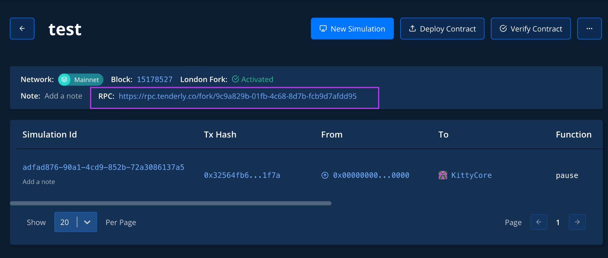
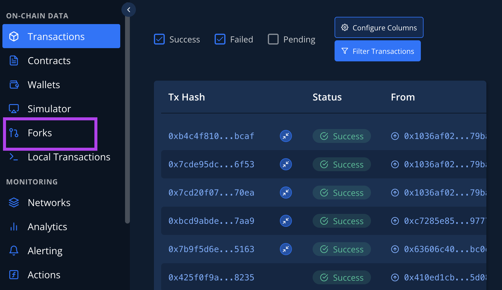

# Verifying Contracts Using the Tenderly Dashboard

You can verify Smart Contracts using the Dashboard UI. This allows you to gain an in-depth understanding of the Smart Contract execution.&#x20;

In case you're not using an elaborate setup for contract deployment, such as Hardhat, a better approach is to use the [code-based approach to verification](verifying-contracts-using-the-tenderly-hardhat-plugin/).

## What's necessary for verification?

To verify a contract, you need to provide:

* **The source code** of the Smart Contract
* **The exact Compiler settings** you used to compile the deployed version

You can upload the source code in several ways using the Dashboard:

* By uploading a JSON file containing [contract metadata](https://docs.soliditylang.org/en/latest/metadata.html) generated by the compiler
* By pasting the source code
* By uploading the source file from your file-system
* By uploading the entire directory with all your Smart Contracts. This makes it easy to verify contracts that have imports from other files on your file-system.

## Public and private modes of verification

When verifying Smart Contracts, you have to choose between two modes: **private** and **public.** Here's a refresher about the key differences.

| Mode                                | Description                                                                    | Best when                                                                                                                                                                 |
| ----------------------------------- | ------------------------------------------------------------------------------ | ------------------------------------------------------------------------------------------------------------------------------------------------------------------------- |
| Public                              | The verified contract and its source code are available to all Tenderly users. | 
You're comfortable with sharing your contract with users outside your project.  You want to enable the callers of your contract to use the monitoring tools.
 |
| 
Private (within Tenderly)
 | The verified contract is visible only to the team/collaborators.               | Suitable during contract development.                                                                                                                                     |


The **Verification** column in the Contracts tab indicates if your contract is verified at all, privately or publicly.


<figure><figcaption>
Verification Status of added contracts
</figcaption></figure>

## Verifying a Smart Contract

After you've [added an unverified contract ](../smart-contracts/#adding-an-unverified-contract)to a Tenderly project, here are the steps to verify it using the Dashboard.

<mark style="color:purple;">**1.**</mark> Find the unverified contract in the contract list and click the **Verify** button next to the verification status.

<mark style="color:purple;">**2.**</mark> Choose between **JSON Upload** and **Contract File Upload** to verify the contract.

* **Pick JSON Upload** if you want to enter the JSON metadata generated by the Solidity compiler.
* **Select Contract File upload** if you want to paste the contract source code directly, upload a single source file, or upload a source directory when importing an entire project such as a Hardhat project. The latter works best for Smart Contracts that import other contracts within your local project.

<mark style="color:purple;">**3.**</mark> Mark the target contract in the next window and click the **Make Private** switch to go with private contract verification.&#x20;

<mark style="color:purple;">**4.**</mark> If the file contains several contracts, pick the one you wish to verify (the deployed to the address shown in step **2**) and repeat the process for others if needed.

If there are any missing contract files, a notification will show up and prompt you to add them to complete the contract verification process.

<mark style="color:purple;">**5.**</mark> Fill in the compiler parameters, including the compiler version, optimization used (true/false), optimization count, EVM version (the latest set by default), and library (one or more library name-address pairs, if required).

<mark style="color:purple;">**6.**</mark> Click the **Finish** button to complete the verification.

## How to bulk-verify Smart Contracts?

If you add several unverified contracts to your project, it's possible to verify them in bulk. Follow these steps:

<mark style="color:purple;">**1.**</mark> Click the **Verify All Contracts** in the Contract section. This will open a modal that lists all the unverified contracts in your project.

<mark style="color:purple;">**2.**</mark> Click the **Add Source** button for each contract you wish to verify and repeat steps 6-8 from the  [Verifying a Smart Contract](verifying-a-smart-contract.md#verifying-a-smart-contract) section.

<mark style="color:purple;">**3.**</mark> Click the **Make Private** switch if you want to go with private verification for any of the contracts.

<mark style="color:purple;">**4.**</mark> Click the **Finish** button after adding the required verification information and complete the process.

Once you upload and verify the Smart Contracts, choose whether to display them all in the transaction list.
